# TrustLoop

A **secure student-only marketplace platform** for Assumption University where students can **buy, sell, donate, and auction items safely within the campus community**.

TrustLoop integrates **secure authentication, transaction management, real-time notifications, and auction functionality** to create a trusted peer-to-peer marketplace environment for university students.

---

# Project Overview

TrustLoop was developed as a **Senior Project** to solve the problem of unsafe and unreliable student-to-student trading in public marketplaces.

Existing platforms such as Facebook Marketplace or external apps lack **identity verification and transaction transparency**, which leads to scams or trust issues.

TrustLoop solves this by restricting the platform to **verified university accounts** and providing **structured transaction flows with system moderation**.

---

# Key Features

## Authentication & Security

- Microsoft Entra ID login (AU student accounts only)
- Session-based authentication using **NextAuth (Auth.js v5)**
- Role-based access control (User / Admin)

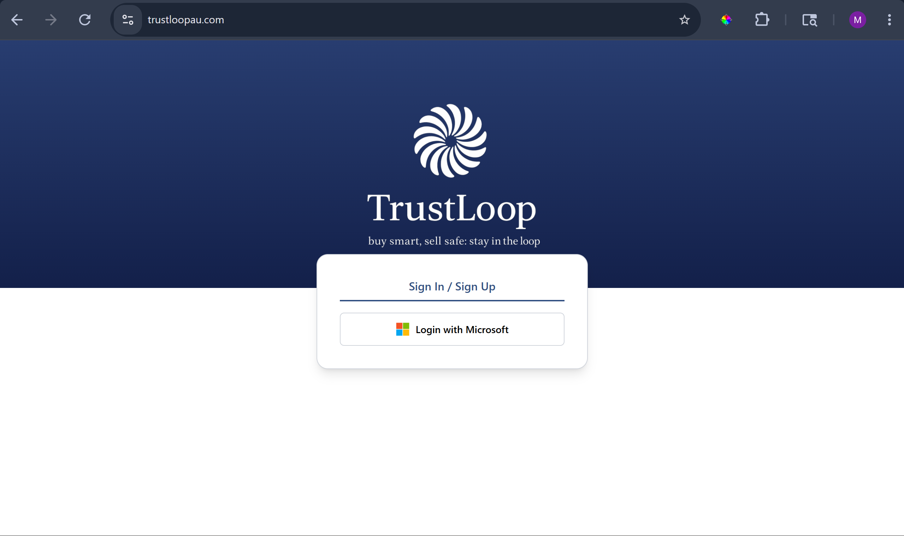

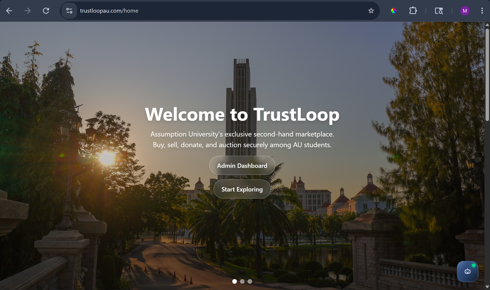

---

## Marketplace System

### Buy & Sell

- Post items with images and descriptions
- Reserve items and complete transactions
- Buyer confirmation and payout release workflow

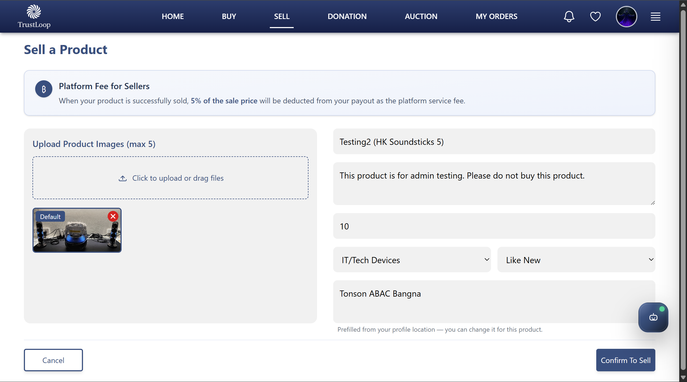

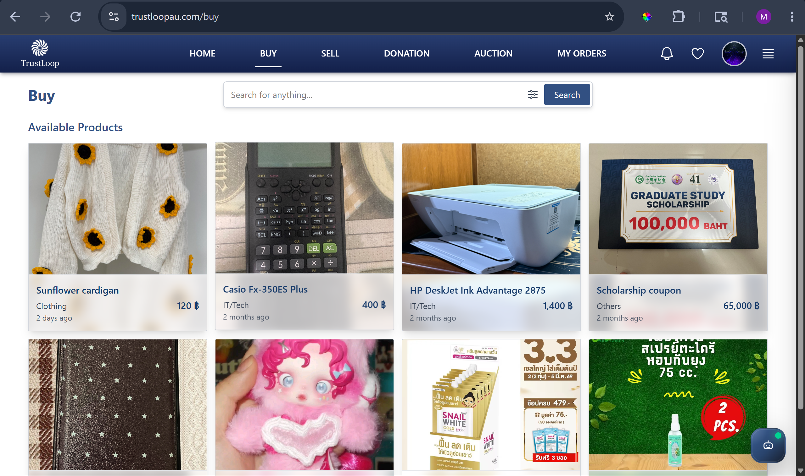

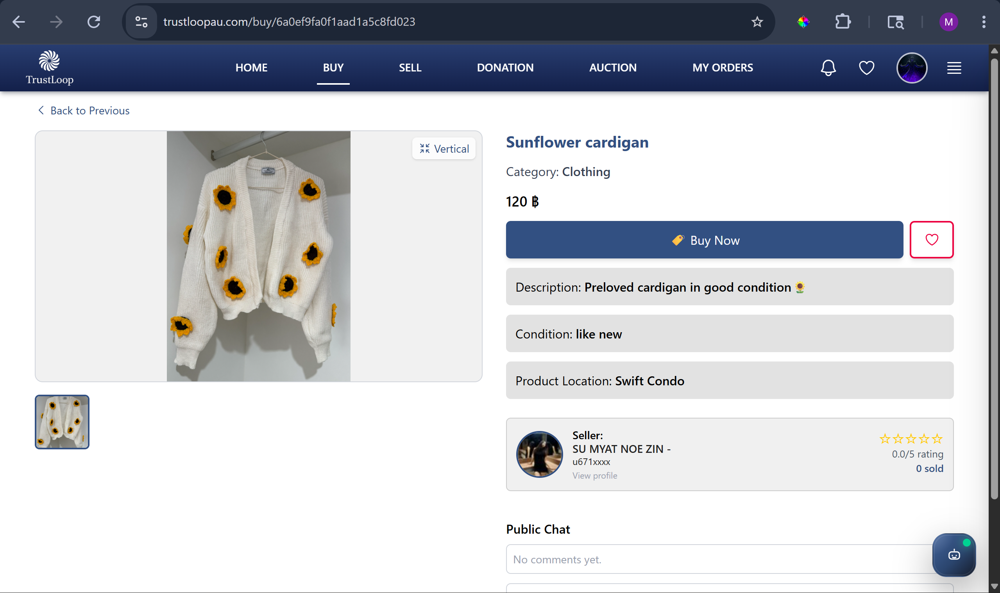

### Auction System

- Real-time auction listings
- Countdown timers for auction deadlines
- Automatic winner assignment
- Payment window for winners
- Automatic reassignment if winner fails to pay

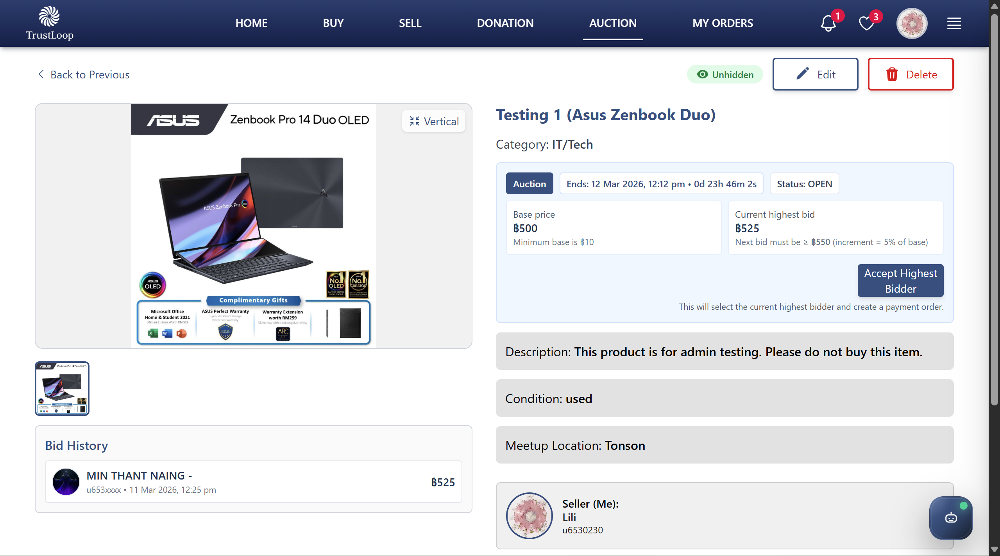

### Donation System

- Request-based donation workflow
- Donor approval process
- Chat coordination for item handoff

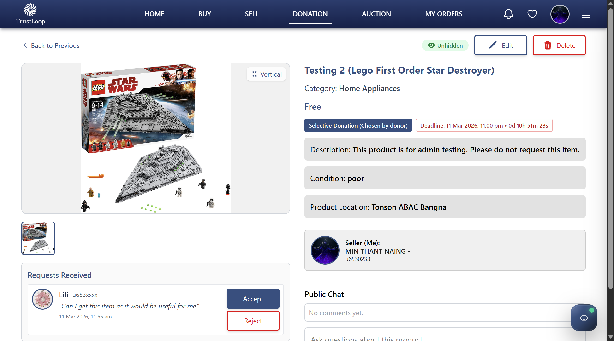

---

## Transaction Management

Structured transaction lifecycle:

1. Order Created
2. Payment Successful
3. Chat & Delivery Coordination
4. Proof Upload
5. Buyer Confirmation
6. Admin Payout to Seller

Automatic handling for:

- Payment expiration
- Auto-confirmation after 3 days
- Refund handling

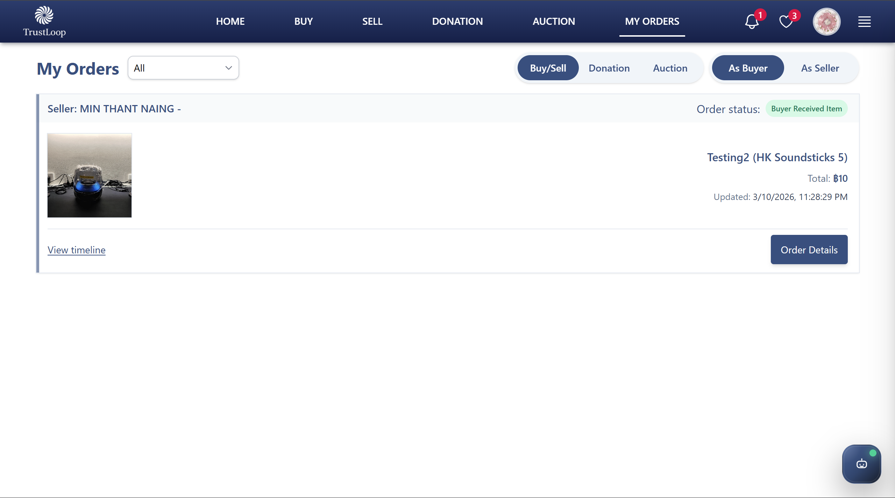

---

## Notification System

TrustLoop provides **two notification channels**:

### In-App Notifications

- Real-time notification system
- Transaction updates
- Auction updates
- Order status changes

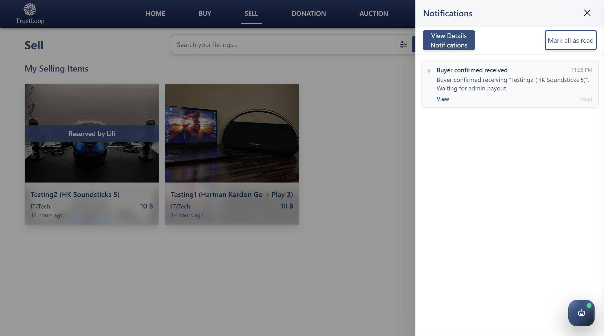

### Email Notifications

Implemented using **Resend API**

Emails are sent only for **important events** such as:

- Payment successful
- Auction winner assigned
- Delivery proof uploaded
- Refund issued
- Admin payout released

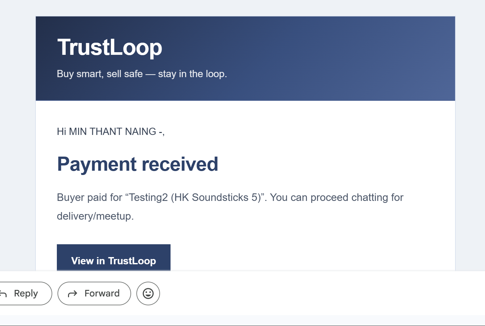

---

## Favorites System

Users can:

- Save favorite products
- Track auction countdowns
- Quickly access saved listings

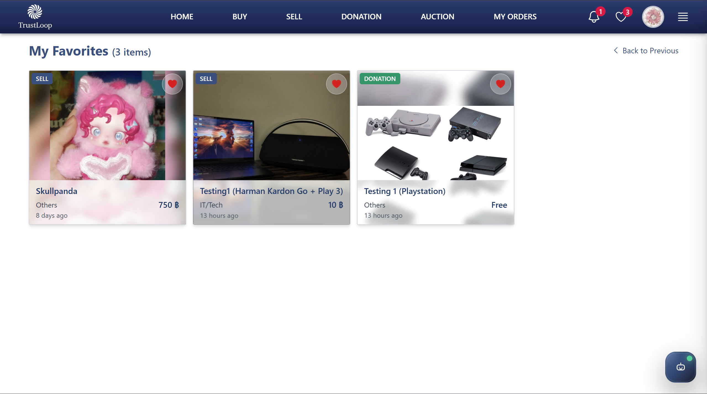

---

## Admin System

Admins can:

- Monitor transactions
- Issue refunds
- Release seller payouts
- Override transaction status
- Manage platform activity

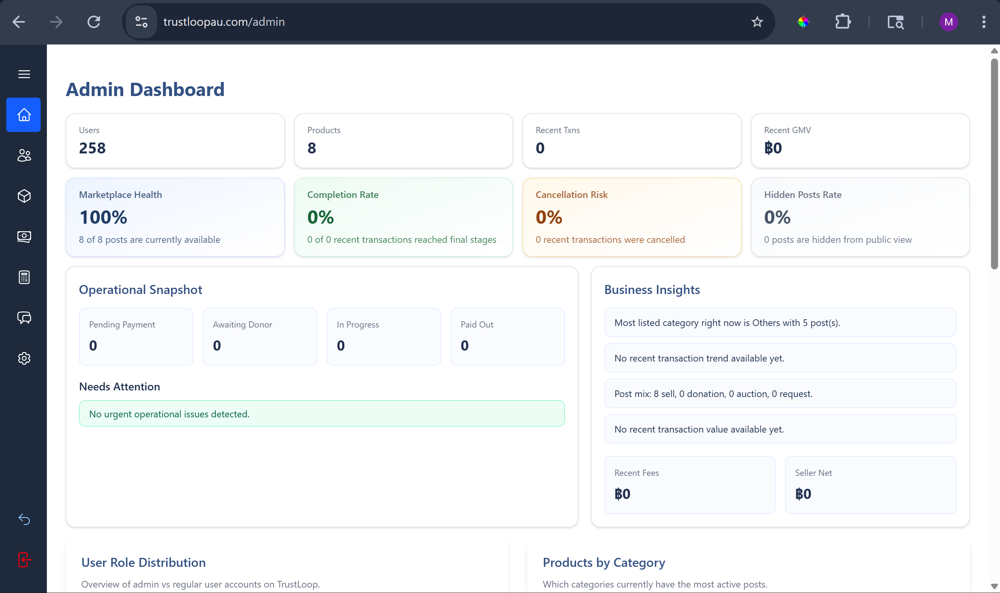

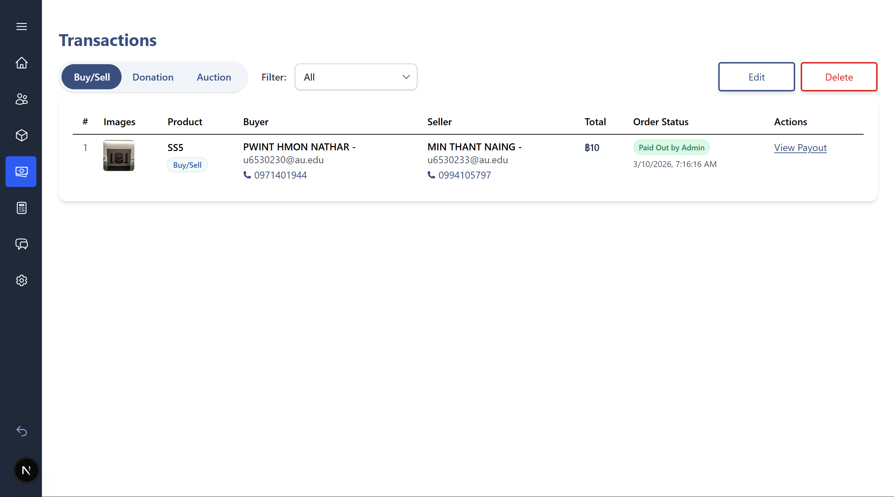

---

# Technology Stack

## Frontend

- Next.js 14 (App Router)
- React
- Tailwind CSS
- Heroicons

---

## Backend

- Next.js API Routes
- Node.js
- MongoDB Atlas
- Mongoose

---

## Authentication

- Auth.js (NextAuth v5)
- Microsoft Entra ID (Azure AD)

---

## Payments

- Stripe
- PromptPay integration

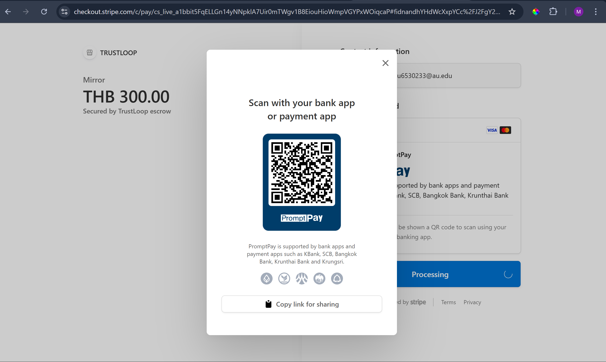

---

## Cloud Services

- Cloudinary – image storage
- Vercel – deployment
- Azure – authentication provider

---

## Email Services

- Resend API for transactional email notifications

---

# Project Architecture

```
TrustLoop
│
├── app/
│   ├── buy/
│   ├── sell/
│   ├── donation/
│   ├── auction/
│   ├── favorites/
│   ├── my-orders/
│   └── admin/
│
├── components/
│   ├── ProductCard
│   ├── NavBar
│   ├── NotificationPanel
│   └── Chatbot
│
├── models/
│   ├── User
│   ├── Product
│   ├── Transaction
│   └── Notification
│
├── lib/
│   ├── notify.js
│   ├── emailTemplates.js
│   ├── db.js
│   └── auctionFlow.js
│
└── api/
    ├── auth/
    ├── users/
    ├── products/
    ├── transactions/
    └── webhooks/
```

---

# Installation

## Clone the repository

```bash
git clone https://github.com/minthantnaing1/trustloop.git
cd trustloop
```

---

## Install dependencies

```bash
npm install
```

---

## Configure environment variables

Create `.env.local`

```
NEXTAUTH_SECRET=
NEXTAUTH_URL=

MONGODB_URI=

AZURE_CLIENT_ID=
AZURE_CLIENT_SECRET=
AZURE_TENANT_ID=

STRIPE_SECRET_KEY=
STRIPE_WEBHOOK_SECRET=

CLOUDINARY_CLOUD_NAME=
CLOUDINARY_API_KEY=
CLOUDINARY_API_SECRET=

RESEND_API_KEY=

APP_BASE_URL=http://localhost:3000
```

---

## Run development server

```bash
npm run dev
```

Open:

```
http://localhost:3000
```

---

# Deployment

TrustLoop is deployed using **Vercel**.

Steps:

1. Push repository to GitHub
2. Connect project to Vercel
3. Add environment variables
4. Deploy

---

# Example Transaction Flow

Example Buy & Sell lifecycle:

```
Buyer creates order
        ↓
Stripe payment completed
        ↓
Seller receives notification
        ↓
Chat coordination
        ↓
Seller uploads delivery proof
        ↓
Buyer confirms receipt
        ↓
Admin releases payout
```

---

# UI Design

TrustLoop uses a **modern campus marketplace interface** with:

- Card-based product listings
- Real-time auction countdown
- Overlay product cards
- Notification indicators
- Chat assistant support

The UI focuses on **clarity, trust, and simplicity for student users**.

---

# Future Improvements

Planned features include:

- Real-time chat system
- AI chatbot for support
- Fraud detection
- Advanced product filtering
- Mobile app version
- Escrow automation

---

# Author

Developed as part of a **Senior Project at Assumption University**.

TrustLoop Team

---

# License

This project is developed for **educational purposes** as part of an academic senior project.

---

# Demo

Live Demo
[https://trustloopau.com](https://trustloopau.com)

---

# GitHub Repository

[https://github.com/minthantnaing1/trustloop](https://github.com/minthantnaing1/trustloop)

---

# Resume Highlight

TrustLoop demonstrates experience with:

- Full-stack web development
- Secure authentication systems
- Payment integration
- Marketplace architecture
- Transaction lifecycle management
- Email notification systems
- Production-ready UI/UX design

---
